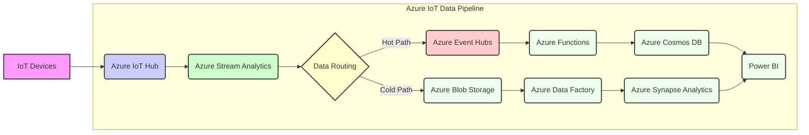

```mermaid

graph LR
    A[IoT Devices] --> B(Azure IoT Hub);
    B --> C(Azure Stream Analytics);
    C --> D{Data Routing};
    D -- Hot Path --> E(Azure Event Hubs);
    D -- Cold Path --> F(Azure Blob Storage);
    E --> G(Azure Functions);
    G --> H(Azure Cosmos DB);
    F --> I(Azure Data Factory);
    I --> J(Azure Synapse Analytics);
    H --> K(Power BI);
    J --> K;

    subgraph Azure IoT Data Pipeline
        B;
        C;
        D;
        E;
        F;
        G;
        H;
        I;
        J;
        K;
    end

    style A fill:#f9f,stroke:#333,stroke-width:2px
    style B fill:#ccf,stroke:#333,stroke-width:2px
    style C fill:#cfc,stroke:#333,stroke-width:2px
    style D fill:#ffc,stroke:#333,stroke-width:2px
    style E fill:#fcc,stroke:#333,stroke-width:2px
    style F fill:#efe,stroke:#333,stroke-width:2px
    style G fill:#efe,stroke:#333,stroke-width:2px
    style H fill:#efe,stroke:#333,stroke-width:2px
    style I fill:#efe,stroke:#333,stroke-width:2px
    style J fill:#efe,stroke:#333,stroke-width:2px
    style K fill:#efe,stroke:#333,stroke-width:2px
```
