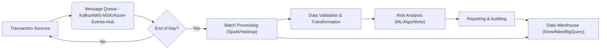

Hi there 👋 I'm Chris DeAcosta
I'm glad you're here.
Welcome to My GitHub Profile

---

High Level real world application I've just completed for a client.



---

```

```mermaid
graph LR
    A[IoT Devices (MQTT)] --> B(AWS IoT Core);
    B --> C(DataStax Astra Streaming);
    C --> D(DataStax Astra DB);
    D --> E(AWS API Gateway);
    E --> F[Microservices];

    subgraph IoT Data Pipeline
        A;
        B;
        C;
        D;
        E;
        F;
    end

    style A fill:#f9f,stroke:#333,stroke-width:2px
    style B fill:#ccf,stroke:#333,stroke-width:2px
    style C fill:#cfc,stroke:#333,stroke-width:2px
    style D fill:#ffc,stroke:#333,stroke-width:2px
    style E fill:#fcc,stroke:#333,stroke-width:2px
    style F fill:#efe,stroke:#333,stroke-width:2px

    linkStyle 0 stroke-width:2px,stroke:blue;
    linkStyle 1 stroke-width:2px,stroke:green;
    linkStyle 2 stroke-width:2px,stroke:orange;
    linkStyle 3 stroke-width:2px,stroke:red;
```

---

```


- 🔭 I’m currently working on ... Data Pipelines in AWS using IoT telemetry data --> IoT Core --> Astra Streaming --> Astra DB
- 🌱 I’m currently learning ... FinOps Cloud Practitioner (Nearly done with Course) FinOps Foundation is Awesome!!!
- 👯 I’m looking to collaborate on ... FinOps tasks
- 💬 Ask me about ... Data Pipelines
- 📫 How to reach me: ... chris.deacosta@gmail.com
- ⚡ Fun fact: ... I love bass fishing, and looking for that elusive lunker bass. -->
```
