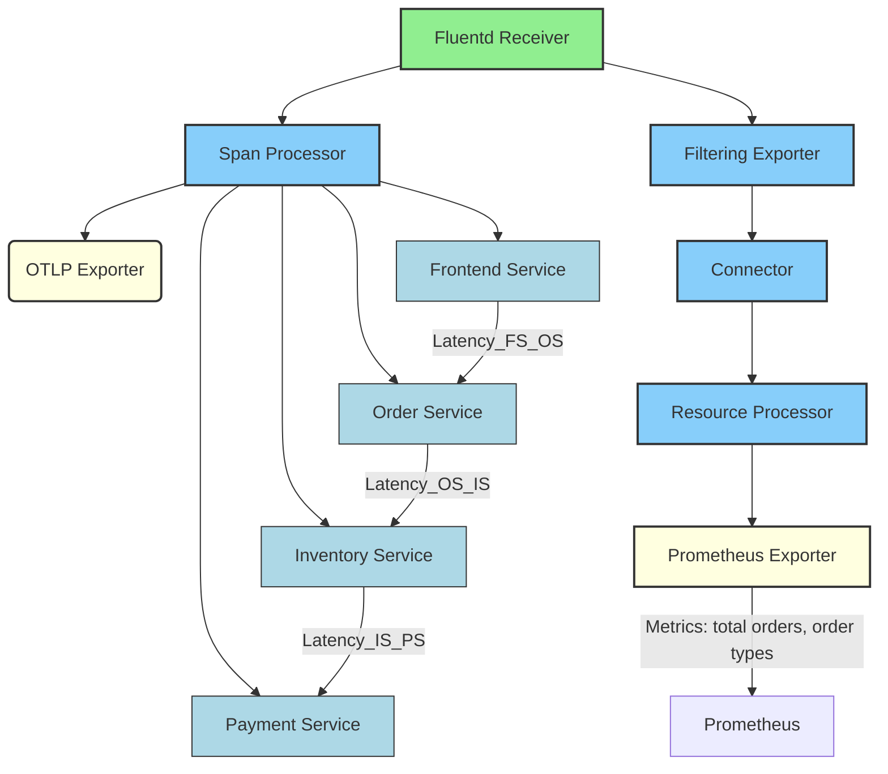
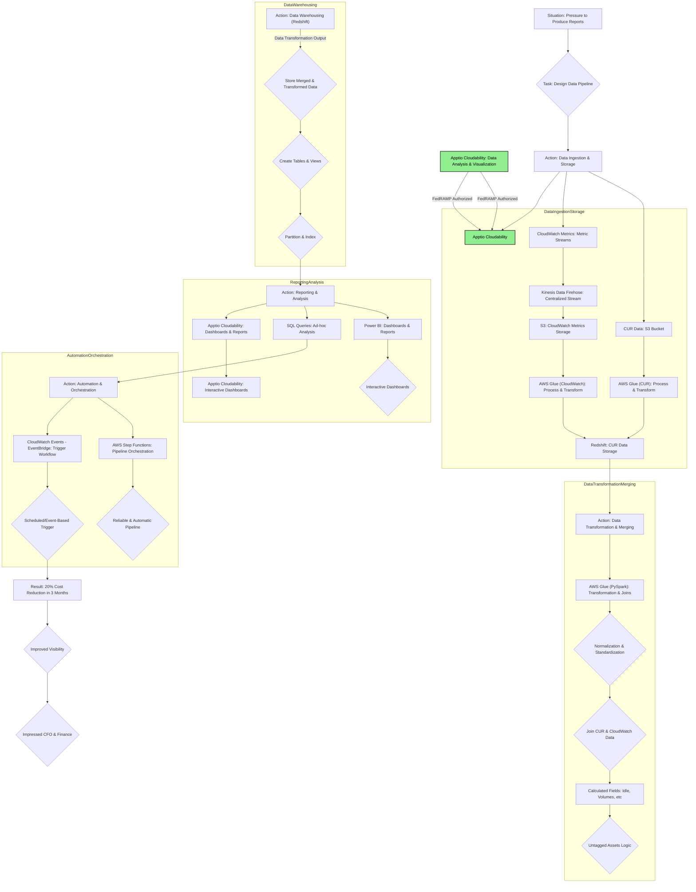
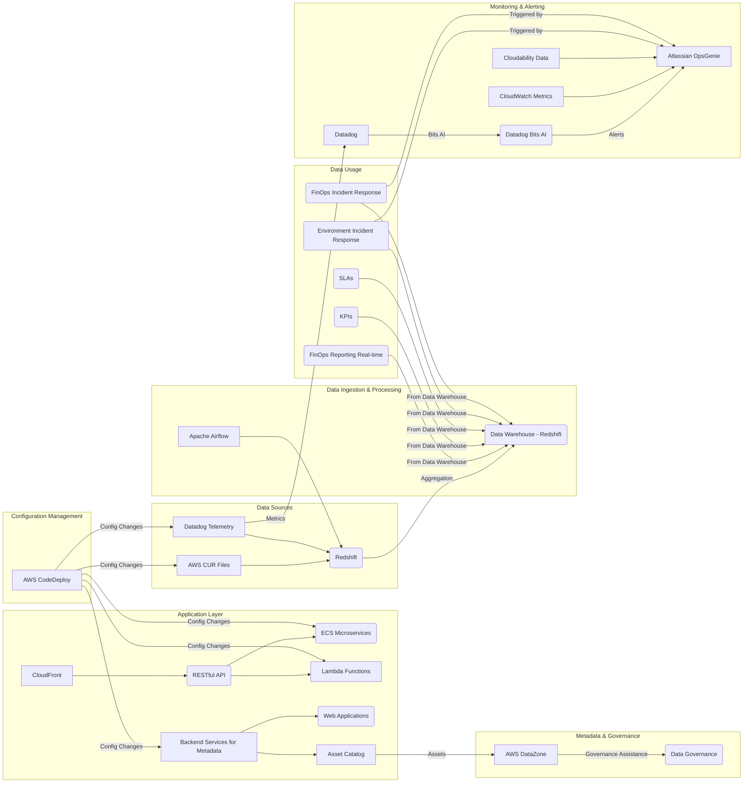
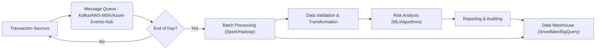
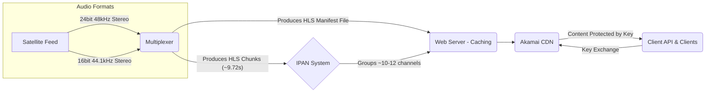

Welcome, I am Chris DeAcosta.

This portfolio provides an overview of a small portion of my project experience. While this profile includes both past and current work, it is important to understand that architecture and software development are a collaborative endeavor. My contributions have frequently centered on architectural design and data workflow implementation. Due to the collaborative nature of these projects, I have a strong understanding of the complete development lifecycle, as all projects were subject to rigorous design reviews. 
###### Note
For projects where I held primary responsibility as the developer, architect, and implementation lead, I have included the following designation: ⭐⭐⭐⭐⭐

## Working On
- 🔭 Data Pipelines in AWS using IoT telemetry data --> IoT Core --> Astra Streaming --> Astra DB (NO DIAGRAM)
- 🔭 A FedRAMP project involving a U.S. Government connected entity.
- 🔭 Datadog w/ Bits AI + Telemetry Data, Cloudability for FinOps reporting dashboards, OpsGenie for alerting,  AWS DataZone for data catalog and data governance. 

## Certifications
- [FinOps Certified Practitioner FOCP  🏆](https://github.com/cdeacosta/cdeacosta/blob/f5f733dcb45dd8bce9192bb926ffadda3604d378/FinOps%20-%20DeAcosta%20certificate-vkzzbp4idzfy-1744318412.pdf)
- [AWS Certified Cloud Practitioner  🏆](https://github.com/cdeacosta/cdeacosta/blob/843c3b054906b89eeb9f5b14c2b88754296b3489/AWS%20Certified%20Cloud%20Practitioner%20certificate.pdf)
- [Project Management Certificate  🏆](https://github.com/cdeacosta/cdeacosta/blob/3414447d89612865c7b83eb9329e47e7b905df7a/Chris-DeAcosta-PMCertificate-KSU.pdf)

## About Me
- When it comes to my career, I enjoy Cloud Architecture, FinOps, SRE, and DevOps
- 💬 Ask me about ... Data Pipelines, they are more important than I thought 15 years ago.
- 📫 How to reach me: ... chris.deacosta@gmail.com
- ⚡ Fun fact: ... I love bass fishing, and looking for that elusive lunker bass. 

---
## Projects

#####  OTEL Sample Work (October 2024)

###### I add this for my friends doing OTEL implementation.  
It can be quite a cost savings to run OTEL agents instead of running your APM of choice.  I personnally find OTEL to be interesting and use cases are significant.

###### OTEL API
Obviously implementing something from the OTEL API is much more time consuming but it gives you the most control.  

###### OTEL SDK
The SDK gives you a higher level abstraction but is far less time intensive but, you get metrics, logs, and traces.  Allows more focus on business logic needed.

###### OTEL Agents
The are configured telemetry nodes or components that automatically gather telemetry data from your application and this does not require any change to the code.  This is my implementation choice because I have no real input into the code.  This is a quick win for collecting telemetry data.

⭐⭐⭐⭐⭐ This is what I'm working on now.  Refining this to add FedRAMP "Authorized" Apptio as a FinOps tool for a U.S. Government associated contract.

---
Outside of starting SiriusXM Streaming from inception, this is the largest project I've ever been a part of.  I am the Cloud Solution Architect for this project.  This representation is probably going to change depending on cost controls.  This is a very expensive solution that so far, the client is not balking at the pricetag.

#### KPIs

[KPIs 📊⚙️📈](https://github.com/cdeacosta/cdeacosta/blob/main/XXXXXXXXXXX_FinOps-SRE_KPIs.xlsx)

#### Description
•	Data Sources: This subgraph shows the initial sources of data: AWS Cost and Usage Report (CUR) files and Datadog telemetry data. Both are ingested into Redshift. 
•	Data Ingestion & Processing: This part illustrates that Redshift acts as the central data warehouse where data is aggregated. Apache Airflow is included as a potential orchestration tool for the data ingestion pipelines. 
•	Data Usage: This section highlights the various purposes for which the data in Redshift is used, including FinOps reporting, tracking KPIs and SLAs, and for incident response related to both the environment and FinOps. 
•	Application Layer: This subgraph depicts the application's front-end (CloudFront), the RESTful API, and the backend microservices hosted in ECS and Lambda functions. It also shows backend services managing metadata for web applications and an asset catalog. 
•	Metadata & Governance: This section shows how the asset catalog connects to AWS DataZone, which assists with data governance. 
•	Configuration Management: AWS CodeDeploy is shown as the tool used to manage configuration changes across various components. 
•	Monitoring & Alerting: This subgraph illustrates how Datadog monitors the environment, leveraging Bits AI for insights. Alerts from Datadog, CloudWatch, and Cloudability are fed into Atlassian OpsGenie for notification and incident management. The environment and FinOps incident response processes are shown as being triggered by these alerts.

---

⭐⭐⭐⭐⭐ Azure Events Hub Data Workflow

---

This is a Kafka Pipeline with four individual topics being written.

---

This is an Azure IoT Pipeline.  I've left off the client name intentionally

---

This is an AWS Cost and Usage Report streaming pipeline flow.  I designed this for a friend who is involved in the early stages of FinOps at Kabbage.

---
Collecting data from a pipeline for status to Slack and Alerting.

---

#### Description
SiriusXM Streaming Content Delivery Process

1. Content Acquisition and Initial Processing:

The audio content originates from a satellite feed, which carries data at a rate of 500 Mbps.
This feed consists of 24-bit, 48 kHz linear uncompressed stereo audio for each of the approximately 470 channels. Alternatively, a 16-bit, 44.1 kHz stereo format was also used.
This high-bandwidth audio stream is fed into a Multiplexer.
2. HLS Chunking and Manifest Generation:

The Multiplexer processes the incoming audio and segments it into HLS (HTTP Live Streaming) chunks. These chunks are approximately 9.72 seconds in length, although the exact duration might vary.
The Multiplexer is also responsible for generating the HLS manifest file. This file contains metadata about the available chunks, including their sequence and timing, which allows client devices to play the content seamlessly.   
3. IPAN System for Channel Grouping:

The generated HLS chunks for each channel are then organized and segmented further using a system called IPAN (likely an internal SiriusXM term for an IP-based audio node or similar).
Each IPAN is responsible for a grouping of approximately 10 to 12 channels. This segmentation likely helps in managing and distributing the large number of channels offered by SiriusXM.
With around 20 IPANs, the system could theoretically handle up to 240 channels (based on the lower estimate of 10 channels per IPAN). To accommodate approximately 470 channels, a greater number of IPANs would be utilized.
4. Web Server Caching:

The output from the IPAN system, consisting of the segmented HLS chunks and the associated manifest files, is then sent to a web server.
This web server acts as a caching mechanism, storing the content temporarily to handle requests efficiently and reduce the load on the originating systems.
5. Content Delivery Network (CDN):

The web server then forwards the HLS chunks and manifest files to a Content Delivery Network (CDN), in this case, Akamai.
Akamai's geographically distributed network of servers ensures that the content is delivered to users with low latency and high availability, regardless of their location.   
6. Content Protection and Key Exchange:

The audio content delivered through Akamai is protected by a content key, preventing unauthorized access.
Clients (user devices running the SiriusXM streaming app) need to perform a key exchange to gain access to this content. This involves communication between the client API (likely a backend service managed by SiriusXM), the client application on the user's device, and Akamai. The specifics of this key exchange process (e.g., the protocol used, the details of authentication and authorization) are not fully detailed in the provided information. However, it ensures that only legitimate SiriusXM subscribers can decrypt and listen to the streamed content.

---

