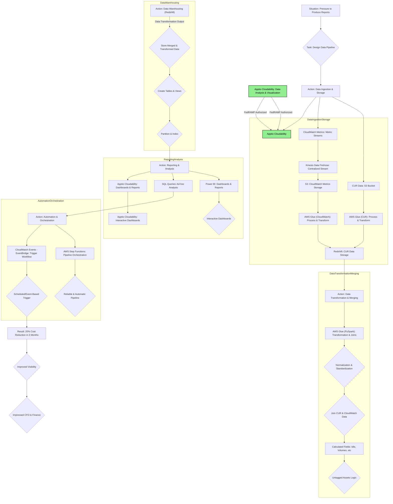
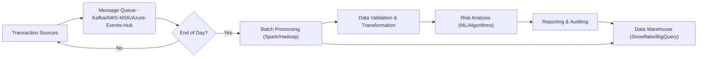
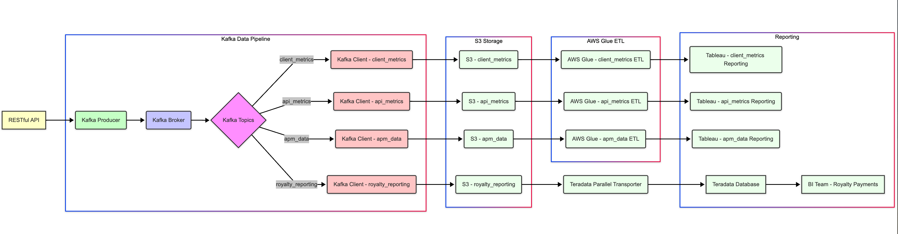
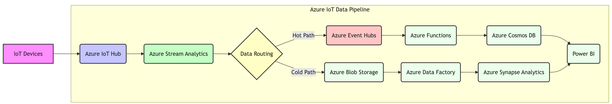
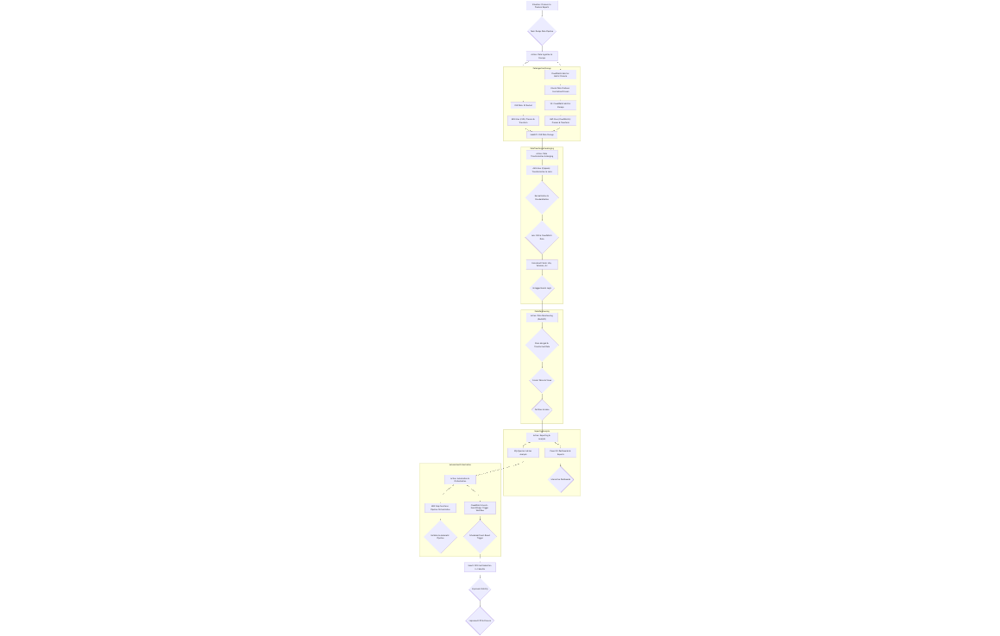
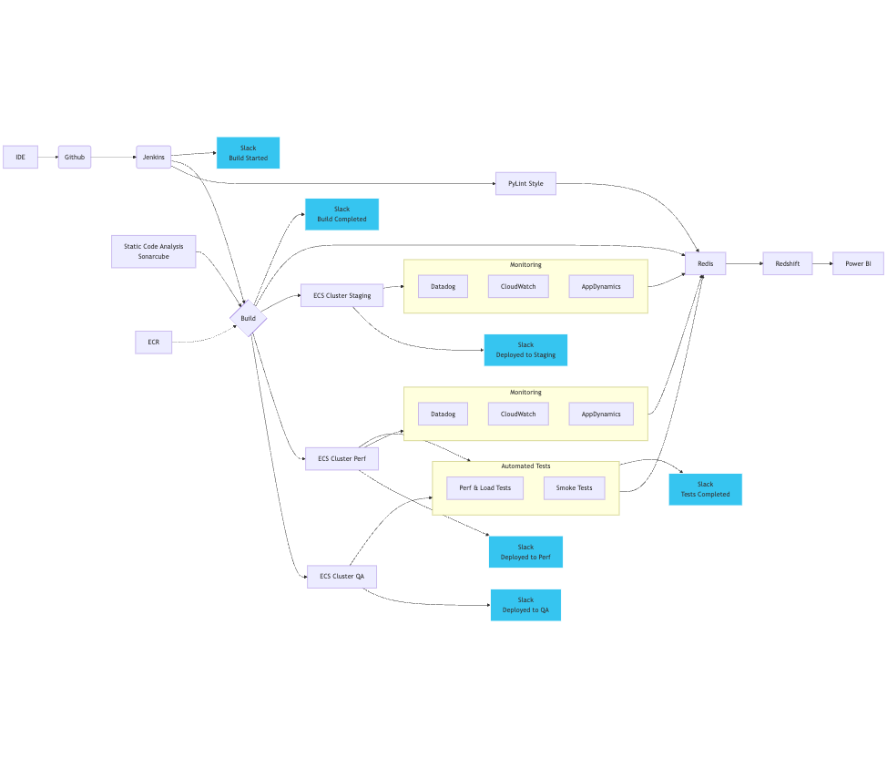
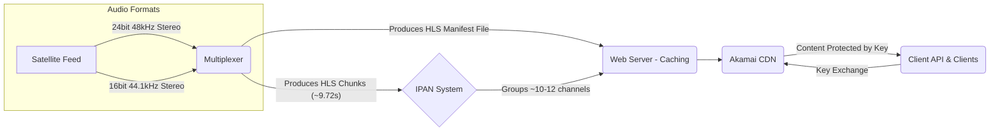

Hi there 👋 I'm Chris DeAcosta
I'm glad you're here.
Welcome to My GitHub Profile
Most of what you see here are projects I've done in the past, OR things that I am working on now.  Not everything is represented here, and I cannot claim every single aspect of these projects has been done with my work alone.  I had a large part in the architecture and many of the data workflows.  I can claim that I know how the work was accomplished since all of these projects had active design reviews.  For the projects I did all or the majority of the work I've put in the following *****

- 🔭 I’m currently working on ... A FedRAMP project, and a Data Pipelines in AWS using IoT telemetry data --> IoT Core --> Astra Streaming --> Astra DB
- 🌱 I’m currently learning ... FinOps Cloud Practitioner (Nearly done with Course) FinOps Foundation is Awesome!!!
- 👯 I’m looking to collaborate on ... FinOps tasks
- [FinOps Certified Practitioner FOCP  🏆](https://github.com/cdeacosta/cdeacosta/blob/f5f733dcb45dd8bce9192bb926ffadda3604d378/FinOps%20-%20DeAcosta%20certificate-vkzzbp4idzfy-1744318412.pdf)
- [AWS Certified Cloud Practitioner  🏆](https://github.com/cdeacosta/cdeacosta/blob/843c3b054906b89eeb9f5b14c2b88754296b3489/AWS%20Certified%20Cloud%20Practitioner%20certificate.pdf)
- [Project Management Certificate  🏆](https://github.com/cdeacosta/cdeacosta/blob/3414447d89612865c7b83eb9329e47e7b905df7a/Chris-DeAcosta-PMCertificate-KSU.pdf)
- 💬 Ask me about ... Data Pipelines
- 📫 How to reach me: ... chris.deacosta@gmail.com
- ⚡ Fun fact: ... I love bass fishing, and looking for that elusive lunker bass. -->

---

***** This is what I'm working on now.  Refining this to add FedRAMP "Authorized" Apptio as a FinOps tool for a U.S. Government agency

---

***** Azure Events Hub Data Workflow

---

This is a Kafka Pipeline with four individual topics being written.

---

This is an Azure IoT Pipeline.  I've left off the client name intentionally

---

This is an AWS Cost and Usage Report streaming pipeline flow.  I designed this for a friend who is involved in the early stages of FinOps at Kabbage.

---
Collecting data from a pipeline for status to Slack and Alerting.

---

SiriusXM Streaming Content Delivery Process

1. Content Acquisition and Initial Processing:

The audio content originates from a satellite feed, which carries data at a rate of 500 Mbps.
This feed consists of 24-bit, 48 kHz linear uncompressed stereo audio for each of the approximately 470 channels. Alternatively, a 16-bit, 44.1 kHz stereo format was also used.
This high-bandwidth audio stream is fed into a Multiplexer.
2. HLS Chunking and Manifest Generation:

The Multiplexer processes the incoming audio and segments it into HLS (HTTP Live Streaming) chunks. These chunks are approximately 9.72 seconds in length, although the exact duration might vary.
The Multiplexer is also responsible for generating the HLS manifest file. This file contains metadata about the available chunks, including their sequence and timing, which allows client devices to play the content seamlessly.   
3. IPAN System for Channel Grouping:

The generated HLS chunks for each channel are then organized and segmented further using a system called IPAN (likely an internal SiriusXM term for an IP-based audio node or similar).
Each IPAN is responsible for a grouping of approximately 10 to 12 channels. This segmentation likely helps in managing and distributing the large number of channels offered by SiriusXM.
With around 20 IPANs, the system could theoretically handle up to 240 channels (based on the lower estimate of 10 channels per IPAN). To accommodate approximately 470 channels, a greater number of IPANs would be utilized.
4. Web Server Caching:

The output from the IPAN system, consisting of the segmented HLS chunks and the associated manifest files, is then sent to a web server.
This web server acts as a caching mechanism, storing the content temporarily to handle requests efficiently and reduce the load on the originating systems.
5. Content Delivery Network (CDN):

The web server then forwards the HLS chunks and manifest files to a Content Delivery Network (CDN), in this case, Akamai.
Akamai's geographically distributed network of servers ensures that the content is delivered to users with low latency and high availability, regardless of their location.   
6. Content Protection and Key Exchange:

The audio content delivered through Akamai is protected by a content key, preventing unauthorized access.
Clients (user devices running the SiriusXM streaming app) need to perform a key exchange to gain access to this content. This involves communication between the client API (likely a backend service managed by SiriusXM), the client application on the user's device, and Akamai. The specifics of this key exchange process (e.g., the protocol used, the details of authentication and authorization) are not fully detailed in the provided information. However, it ensures that only legitimate SiriusXM subscribers can decrypt and listen to the streamed content.

---

